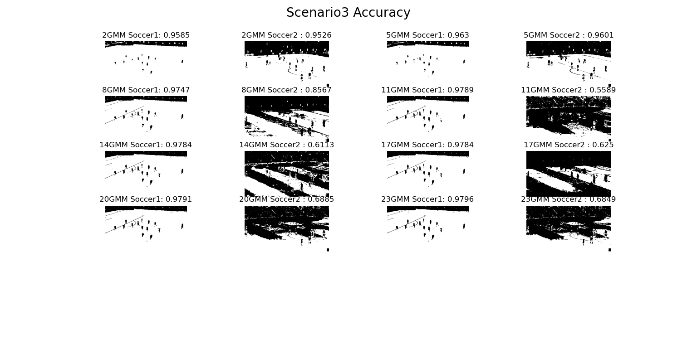

# Hw4 GMM-based Color Image Segmentation
資訊111 F74071263 倪皓城
# Environments
OS: Windows 10/Ubuntu 20.04 Python: 3.7.0
## Execution
### Scenario 1 & Scenario 2
```
python scenario1.py
```
### Scenario 3
```
python scenario3.py
```

# Introduction
## Algorithm
透過sklearn的 Gaussian Miaxture library完成，首先讀取image並且丟進model training，因為作業要求判別場地或非場地，所以當 mixture component設定>2時將model回傳的陣列出現最多次的component設為1其餘設為0，最後再同乘255變成mask形式去比對accuracy。
## Different Number of Mixture Component

