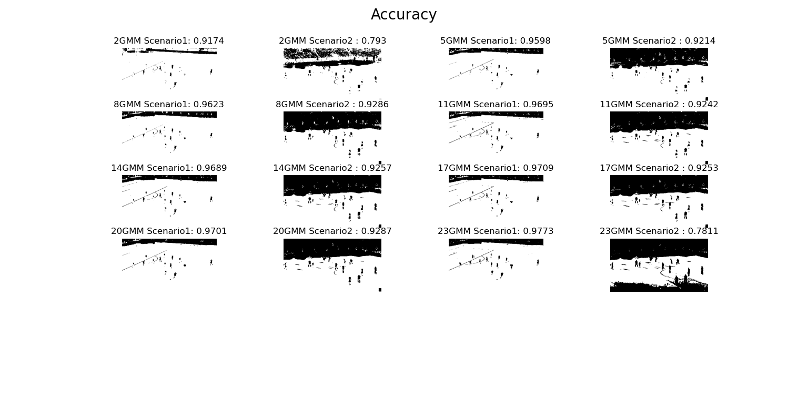

# Hw4 GMM-based Color Image Segmentation
資訊111 F74071263 倪皓城
# Environments
OS: Windows 10/Ubuntu 20.04 Python: 3.7.0
## Execution
### Scenario 1 & Scenario 2
```
python scenario1.py
```
### Scenario 3
```
python scenario3.py
```

# Introduction
## Algorithm
透過sklearn的 Gaussian Miaxture library完成，首先讀取image並且丟進model training，因為作業要求判別場地或非場地，所以當 mixture component設定>2時將model回傳的陣列出現最多次的component設為1其餘設為0，最後再同乘255變成mask形式去比對accuracy。
## Accuracy




### Different Mixture Component
透過上面兩張實驗結果可以看出soccer1幾乎不受影響，soccer2一開始accuracy有上升趨勢，但隨者components上升accuracy也急遽下降。

比較soccer1與soccer2，推測是因為soccer2拍到的觀眾席顏色比較混雜導致一開始accuracy不理想，而soccer1只有場地與球員image segamentation會比較好


### Different Scenario
上面兩張實驗圖我們單看GMM=2時，可看出因為model是使用soccer1進行建構，所以測試soccer2(Scenario2) accuracy很差。

看到 Scenaro3因為model使用soccer1與soccer2進行建構，所以 測試soccer2時的accuracy比較佳。
